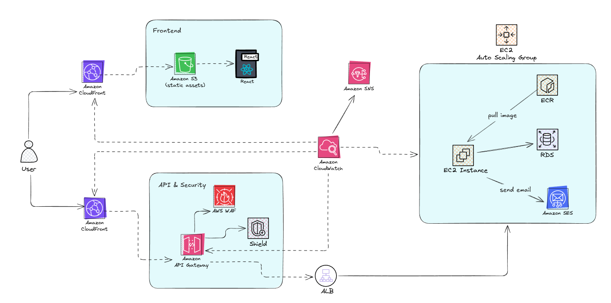
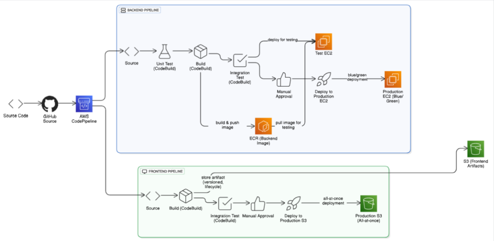
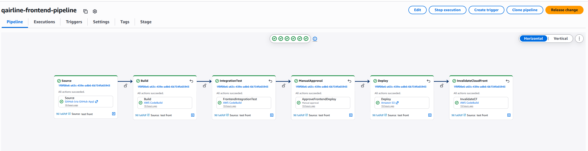
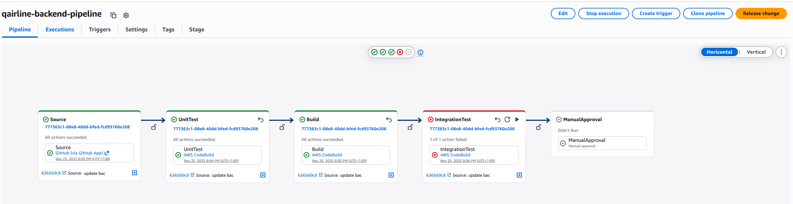

# QAirline - Airline Booking System Project Overview

QAirline is a robust airline booking system designed to streamline flight searching, booking, and administrative tasks. It offers a clean, user-friendly interface for customers to book flights and for administrators to manage flight details, passenger reservations, and airplane information.

**Cloud Architecture**

**CI/CD CodePipeline**

**Frontend pipeline**

**Backend pipeline**

